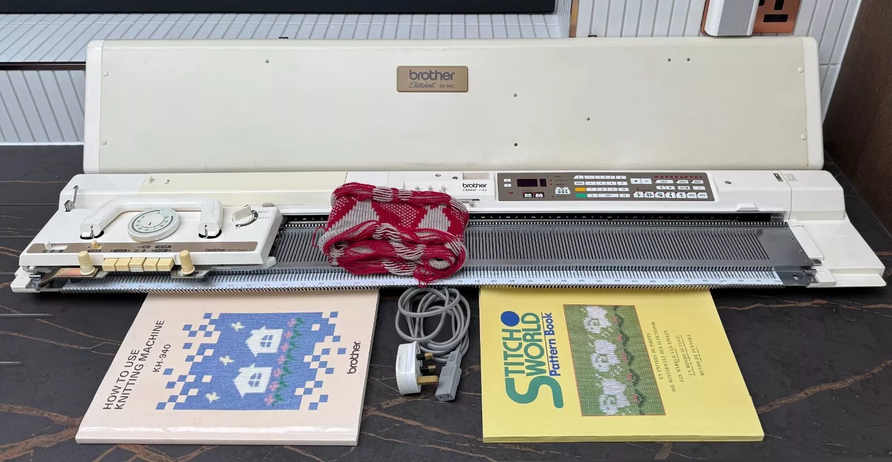
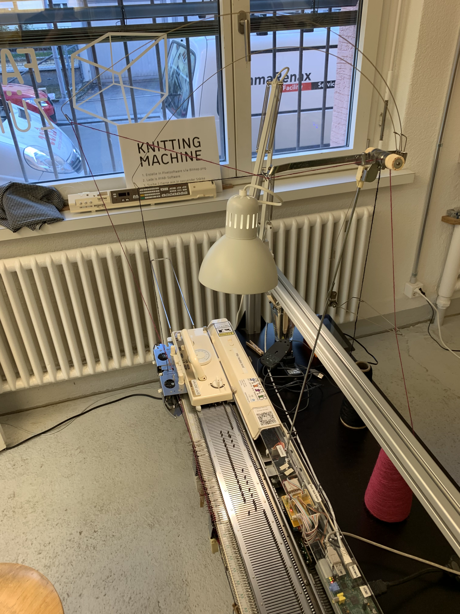
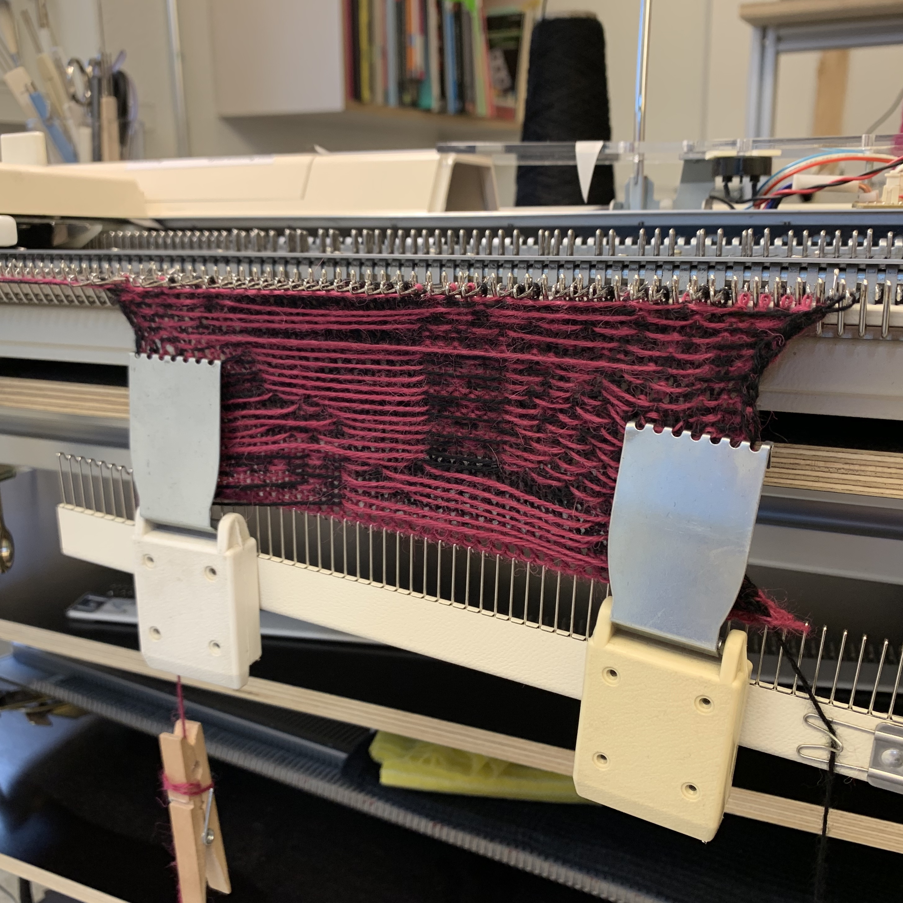
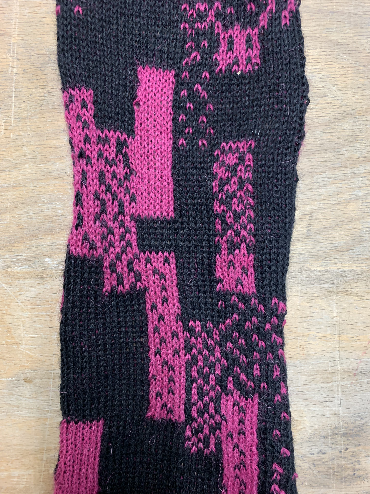
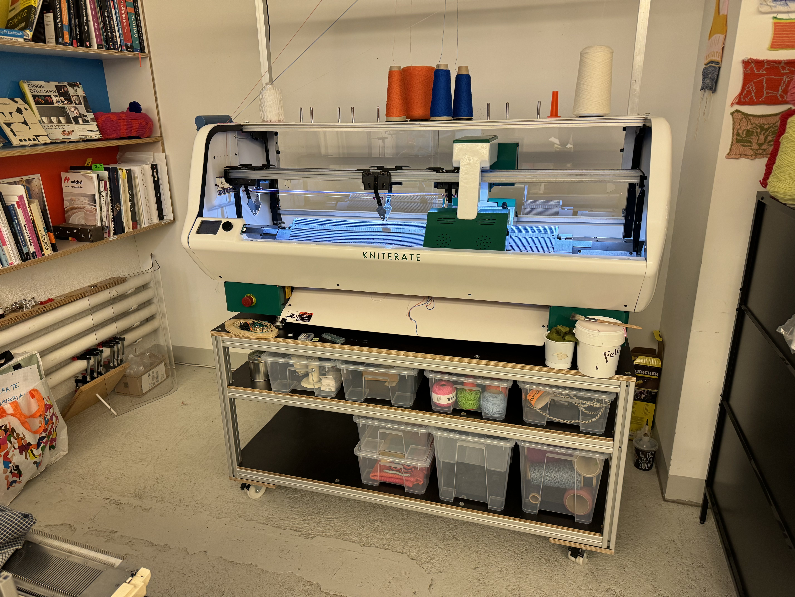
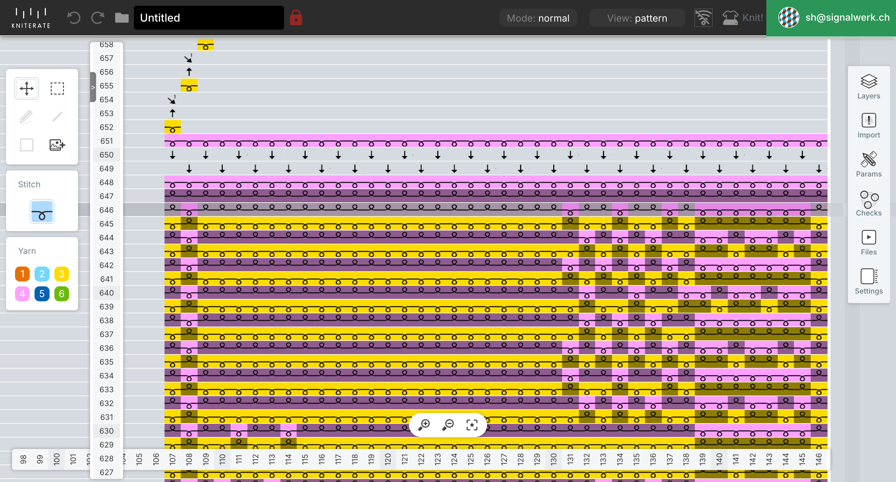
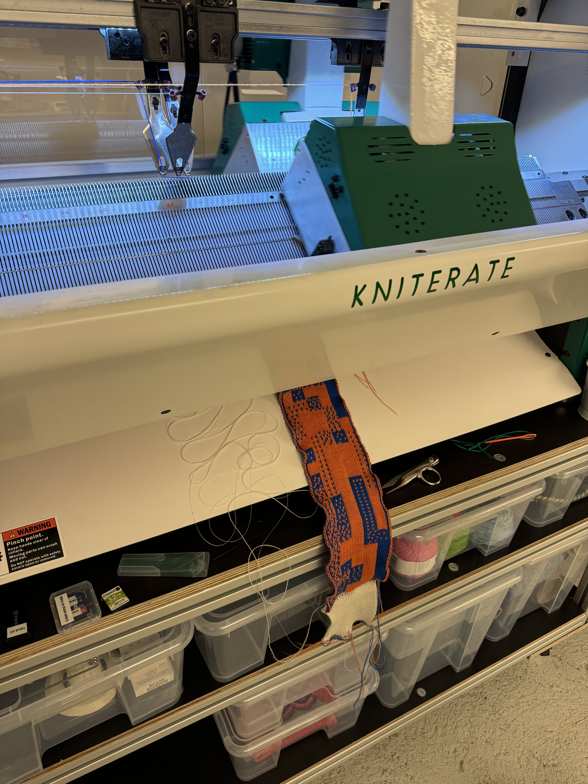
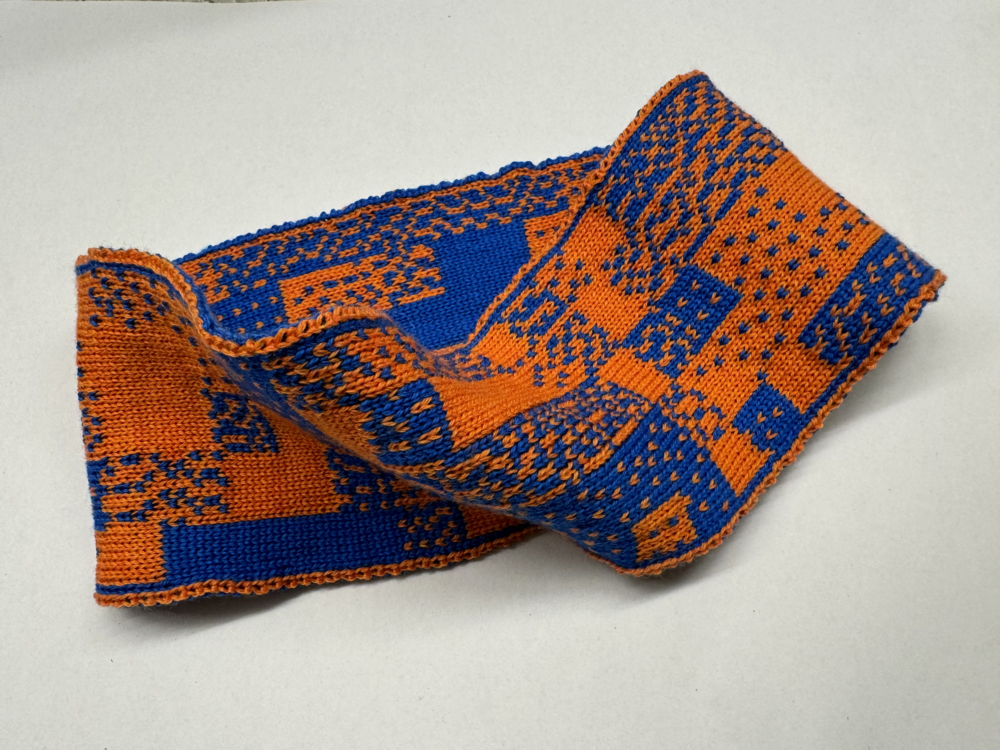
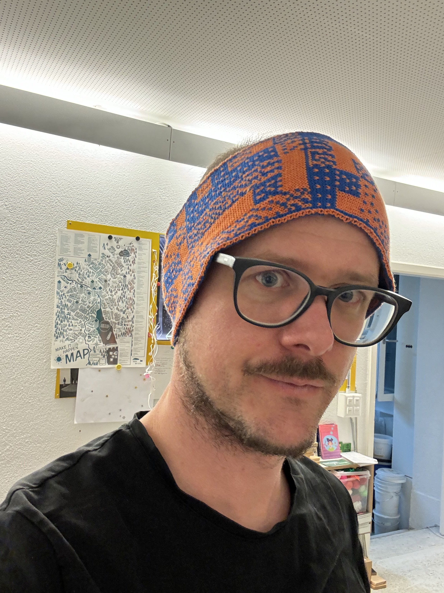

```fm
style: negative
background: true
```

## Hello _👋_

# {{process.content.frontmatter.title}}

_vom Comutper zum Schal_

<footer>

2025 · Zurich · Stefan Huber

</footer>

--s--

```fm
style: image
background:
  iframe: https://signalwerk.github.io/dither/?autorefresh
```

## Design

--s--

```fm
style: image
background:
  image: img/SingerDoubleBedKnittingMachine_exp.png
  position: 50% 50%
```

## 80er Jahre

<footer>

Quelle: Singer MK1 Double Bed Knitting Machine Instruction Manual

</footer>

--s--

```fm
style: negative
background: true
```

## Erster Versuch

# _Brother KH-940_

--s--

## Brother KH-940



--s--

## Verbunden mit Computer



--s--

## Rückseite



--s--

## Abketten

<video controls muted autoplay loop>
  <source src="./img/conv/IMG_0124.mp4" type="video/mp4" />
  Your browser does not support the video tag.
</video>

--s--

## Vorderseite



--s--

```fm
style: negative
background: true
```

## Zweiter Versuch

# _Kniterate_

--s--

## Kniterate



--s--

## Kniterate · Software



--s--

## Doppelbett-Jacquard

<video controls muted autoplay loop>
  <source src="./img/IMG_5118.MOV" type="video/mp4" />
  Your browser does not support the video tag.
</video>

--s--

## Doppelbett-Jacquard



--s--

## Resultat

<div class="grid">
<div class="col8 img--w100p">



</div>
<div class="col3 img--w100p">



</div>
</div>

--s--

```fm
style: negative
background: true
```

## _Kniterate · Wo?_

# [Fablab Zürich](https://zurich.fablab.ch/)

Kreis 4, Zürich

--s--

```fm
style: negative
background: true
```

## Merci

# _Fragen?_
